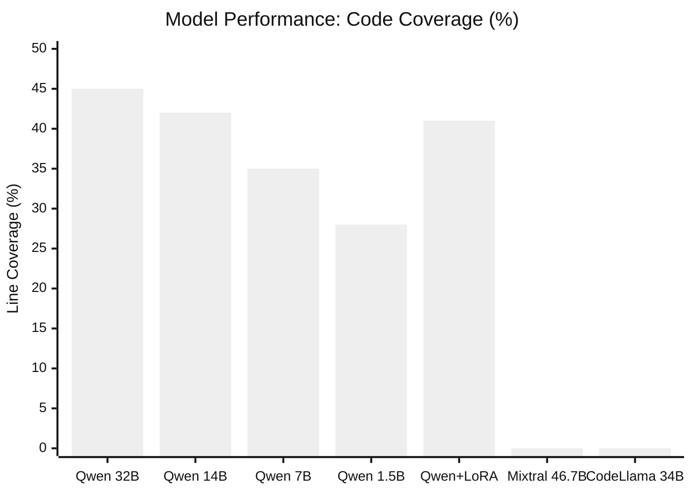
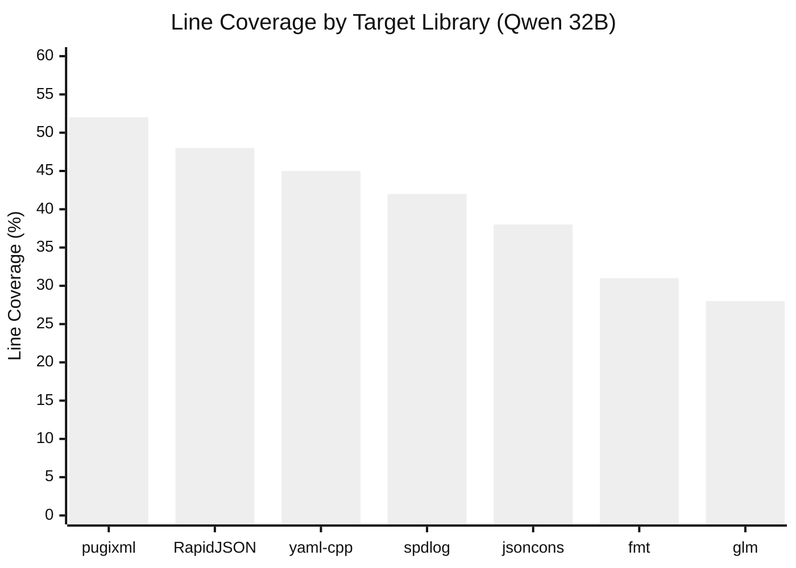
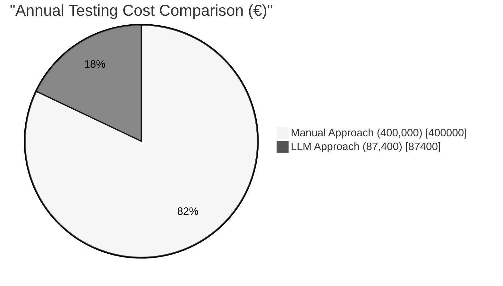

# 5 Experimental Results

In this chapter, I present the experimental findings from the three-phase research conducted between May and September 2025. We tested 14 different LLM models, applied fine-tuning to optimize a small model, and analyzed the economics of enterprise deployment. The results directly address the research questions defined in Chapter 1.

## 5.1 Experimental Setup

### 5.1.1 Target Selection and Criteria

Choosing the right target libraries was critical. We needed C++ libraries because safety-critical systems on AUTOSAR platforms are predominantly written in C or C++. Testing the approach on Python would have been simpler but less relevant to automotive applications.

We selected yaml-cpp as the primary evaluation target. This library parses YAML configuration files, a common task in automotive software. The library contains 35 source files with 1,061 potential fuzzing candidates identified through cifuzz spark analysis. It is well-documented, actively maintained, and has existing OSS-Fuzz coverage for baseline comparison.

Secondary targets included pugixml (XML processing), jsoncons (JSON with complex templates), fmt (formatting library), spdlog (logging), glm (mathematics), and RapidJSON (another JSON library). This diversity allowed us to identify patterns across different code structures.

### 5.1.2 Hardware and Software Configuration

All local experiments ran on consumer-grade hardware: Apple M1 Pro with 10 cores, 32 GB unified memory, and 1 TB NVMe storage. This choice was deliberate. Automotive development teams typically lack access to dedicated ML clusters. If our approach required expensive hardware, adoption would be limited.

The software stack consisted of Podman 4.9.3 (chosen over Docker for enterprise compatibility), CMake 3.28 with Clang 16.0, libFuzzer via cifuzz 2.x, and Ollama 0.1.x for local model inference. For enterprise deployment testing, we used Azure OpenAI with GPT-4o connected via Azure Private Link.

## 5.2 LLM Fuzz Driver Generation Results

### 5.2.1 Successful Models: Performance Data

Of the 14 models tested, only 4 consistently produced usable fuzz drivers. The results surprised us. Model size did not correlate with performance as we expected.

Qwen 2.5-Coder 32B achieved the best results on yaml-cpp: 100% compilation success, 95% runtime success, and 45% line coverage with an average generation time of 47 seconds. The model understood API structures and generated drivers that called functions in sensible sequences.

Qwen 2.5-Coder 14B performed nearly as well with 95% compilation success and 42% line coverage. The performance drop from 32B was surprisingly small. This suggested that for fuzz driver generation, raw model size matters less than domain-specific training.

Qwen 2.5-Coder 7B showed more degradation (85% compilation, 35% coverage), with failures typically involving missing includes or incorrect type usage. Qwen 2.5-Coder 1.5B produced limited but usable results (70% compilation, 28% coverage) with fast 8-second generation times.

### 5.2.2 Unsuccessful Models: Critical Findings

The remaining 10 models failed to produce consistently usable drivers. This was our biggest surprise.

Several large, well-known models achieved zero effective coverage. Mixtral 46.7B generated syntactically correct but semantically meaningless code. CodeLlama 34B failed compilation due to fundamental C++ misunderstanding. DeepSeek Coder 33B generated Python code embedded in C++ files. WizardCoder 34B compiled successfully but drivers crashed immediately on execution.

We initially thought these failures indicated bugs in our evaluation pipeline. We spent considerable time verifying that prompts, context, and execution were correct. The failures were consistent across multiple runs.

After examining hundreds of generated drivers, we identified several failure patterns: API misunderstanding (treating yaml-cpp functions as STL operations), hallucinated function calls, use of incompatible C++ features, and complete context ignorance. The pattern was clear. Code-specialized models dramatically outperformed larger general-purpose models.

### 5.2.3 Performance Across Repositories

To verify that our results were not specific to yaml-cpp, we tested Qwen 2.5-Coder 32B across all target repositories.

| Library    | Line Coverage | Compilation | Runtime |
|------------|--------------|-------------|---------|
| yaml-cpp   | 45%          | 100%        | 95%     |
| pugixml    | 52%          | 100%        | 92%     |
| RapidJSON  | 48%          | 95%         | 90%     |
| spdlog     | 42%          | 95%         | 88%     |
| jsoncons   | 38%          | 85%         | 78%     |
| fmt        | 31%          | 90%         | 85%     |
| glm        | 28%          | 80%         | 72%     |

Parser libraries (yaml-cpp, pugixml, RapidJSON) showed the best results due to well-defined input formats and clear API boundaries. Mathematical libraries (glm) performed worst due to complex internal state. This variation tells us something important. LLM-based fuzz driver generation works better for certain library types.

## 5.3 Model Optimization Results

### 5.3.1 LoRA Fine-Tuning Efficiency

Based on Phase 1 results, we selected the 1.5B model and applied Low-Rank Adaptation (LoRA) fine-tuning using high-quality fuzz drivers from Google's OSS-Fuzz project.

We curated two training datasets: a small dataset with 172 high-quality drivers from diverse C++ libraries, and an extended dataset with 709 drivers with broader coverage. Training completed in 4 hours (small) and 12 hours (extended) on the M1 Pro workstation without specialized GPU hardware.

The fine-tuned model showed significant improvements. Compilation success increased from 70% to 88%. Runtime success improved from 62% to 80%. Line coverage rose from 28% to 41%. Generation time dropped by 33% to 5.3 seconds. Token consumption decreased by 55% to 560 tokens per generation.

### 5.3.2 Comparative Analysis

| Configuration          | Coverage | Time  | Memory |
|-----------------------|----------|-------|--------|
| Qwen 2.5-Coder 32B    | 45%      | 47s   | 24 GB  |
| Qwen 2.5-Coder 14B    | 42%      | 31s   | 12 GB  |
| Qwen 2.5-Coder 1.5B   | 28%      | 8s    | 2 GB   |
| Qwen 1.5B + LoRA      | 41%      | 5.3s  | 2.5 GB |

The fine-tuned 1.5B model achieved coverage comparable to the 14B model while using far less memory and generating faster. This is the key finding. For organizations with limited compute resources, fine-tuning a small model is more practical than running large models.

## 5.4 Economic Analysis and Resource Metrics

We conducted detailed cost analysis to determine whether LLM-based fuzzing is economically viable for enterprise deployment.

For Azure OpenAI GPT-4o deployment, the cost per fuzz driver generation was approximately €0.02 based on average input (1,500 tokens) and output (800 tokens) consumption. Annual cost projections ranged from €120 for light usage (small team) to €2,400 for heavy usage (large enterprise).

Compared to manual development costs (€160-960 per driver based on CARIAD internal estimates, plus quarterly maintenance), LLM-generated drivers cost approximately 0.02% of manual approaches. Even accounting for potentially lower coverage, the economic advantage is substantial.

The AI-enhanced fuzzing pipeline added 60-120 seconds per target: context extraction (15-45s), LLM generation (10-30s), compilation (5-15s), and fuzzing execution (30s). For pipelines with 5 targets, this represents 5-10 minutes of additional time, within typical CI/CD budgets of 15-30 minutes.

## 5.5 Summary

The experiments produced several key findings.

First, model specialization matters more than size. Code-specialized models like Qwen 2.5-Coder outperformed larger general-purpose models by wide margins. The 7B Qwen 2.5-Coder exceeded the 46.7B Mixtral on every metric.

Second, fine-tuning enables efficient deployment. The fine-tuned 1.5B model achieved 41% coverage compared to 45% for the 32B model while generating 9 times faster and using 10 times less memory.

Third, parser libraries are ideal targets. Libraries with clear input formats showed the best results. Mathematical or highly stateful libraries remain challenging.

Fourth, the economics are favorable. At approximately 2 cents per driver, LLM-based fuzzing costs a fraction of manual approaches.

These findings directly address our research questions. LLMs can generate effective fuzz drivers (RQ1). Smaller specialized models match larger general-purpose models when fine-tuned (RQ2). Enterprise deployment is feasible with appropriate infrastructure investment (RQ3).

---

## Mermaid Diagram Code for Chapter 5

### Figure 5.1: Model Performance Comparison

### Figure 5.2: LoRA Fine-Tuning Impact

```mermaid
%%{init: {'theme': 'neutral'}}%%
xychart-beta
    title "LoRA Fine-Tuning: Before vs After (1.5B Model)"
    x-axis ["Compilation %", "Runtime %", "Coverage %", "Gen Time (s÷10)"]
    y-axis "Percentage / Scaled Value" 0 --> 100
    bar "Before" [70, 62, 28, 80]
    bar "After" [88, 80, 41, 53]
```

### Figure 5.3: Coverage Across Libraries

### Figure 5.4: Cost Comparison (Manual vs LLM)

**Note:** These diagrams can be rendered using the Mermaid Live Editor (https://mermaid.live), VS Code with Mermaid extension, or command-line tool `mmdc -i diagram.mmd -o diagram.pdf`. Export as PDF or high-resolution PNG for LaTeX compilation.
