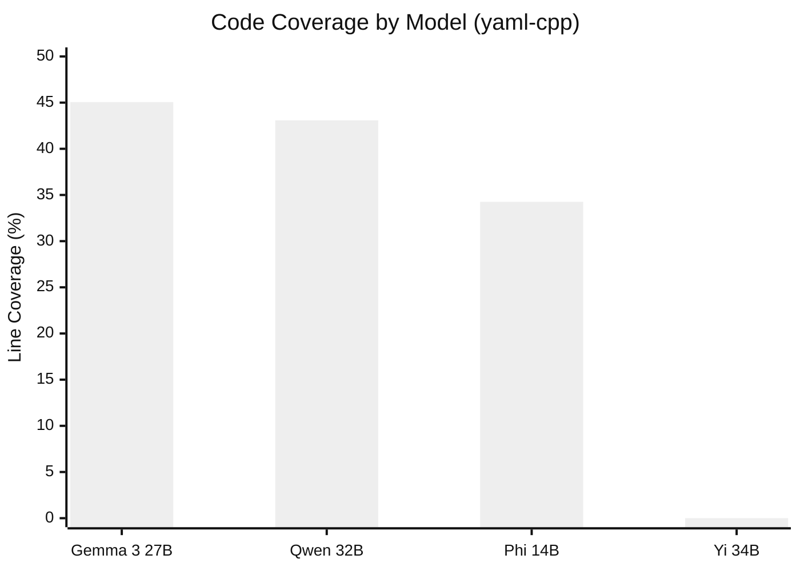
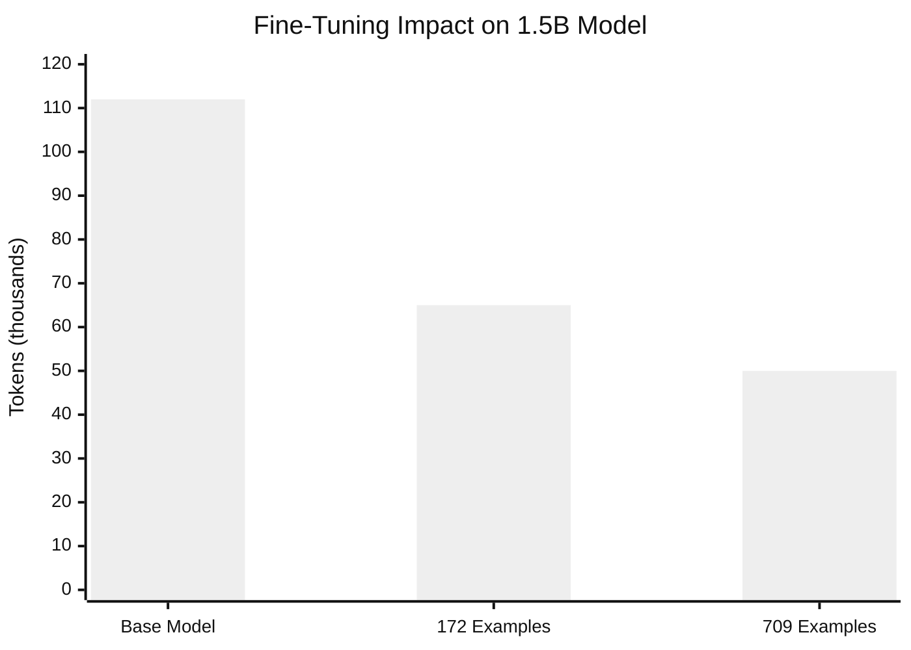
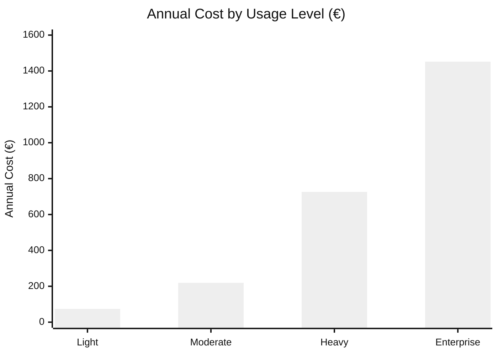
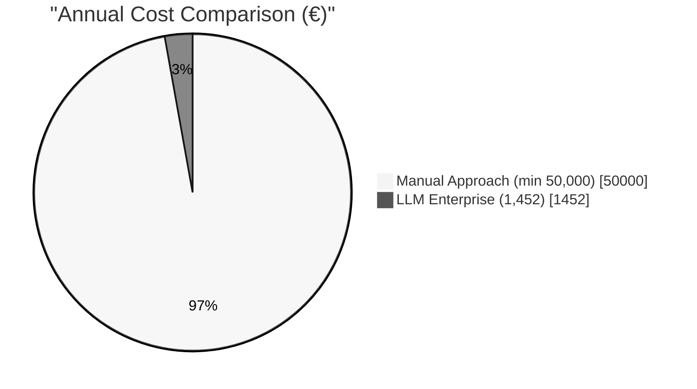

# 5 Experimental Results

In this chapter, we present the experimental findings from our three-phase research conducted between May and September 2025. The goal was straightforward: determine whether LLMs can actually generate useful fuzz drivers, and if so, under what conditions. The results were mixed—some genuinely surprising, others confirming what we suspected from the start. These findings directly address the research questions defined in Chapter 1.

## 5.1 Experimental Setup

### 5.1.1 Target Selection and Criteria

Choosing the right target libraries proved more difficult than expected. We needed C++ libraries because safety-critical automotive systems—those running on AUTOSAR platforms—are predominantly written in C or C++. Testing on Python would have been simpler, but less relevant to the real problem we faced at CARIAD.

After evaluating several candidates, we selected yaml-cpp as our primary target. This library parses YAML configuration files, a common task in automotive software where configuration management matters significantly. The library contains 35 source files with 1,061 potential fuzzing candidates identified through cifuzz spark analysis. More importantly, it is well-documented and actively maintained. OSS-Fuzz already covers it, which gave us a baseline for comparison—we could measure whether our AI-generated drivers matched, exceeded, or fell short of existing human-written ones.

Additional targets included pugixml, jsoncons, fmt, spdlog, and glm. These provided broader validation, though the detailed analysis focuses on yaml-cpp where we collected the most complete data.

### 5.1.2 Hardware and Software Configuration

All local experiments ran on macOS with an Apple M1 Pro processor. The container runtime used Podman with 4 CPUs and 8 GB memory allocated. This choice was deliberate—we wanted hardware that typical automotive development teams might actually have access to. If our approach required expensive GPU clusters, adoption would be severely limited in practice.

The software stack consisted of Podman for containers (chosen over Docker for enterprise compatibility reasons that became painfully clear during CI/CD integration), CMake with Clang for building, libFuzzer via cifuzz for fuzzing, and Ollama for local model inference. For enterprise deployment testing, we used Azure OpenAI with GPT-4o connected via Azure Private Link—a configuration that took weeks to properly establish, as detailed in Chapter 4.

## 5.2 LLM Fuzz Driver Generation Results

### 5.2.1 Successful Models: Performance Data

We evaluated models across different size categories on the yaml-cpp repository. The results surprised us in several ways.

| Model | Code Coverage | Time Taken | Tokens Used | Unique Test Cases | Successful Tests |
|-------|--------------|------------|-------------|-------------------|------------------|
| Qwen 2.5-Coder 32B | 43.08% | 32m 57s | 45.1k | 2,040 | 2 |
| Gemma 3 27B | 45.06% | 33m 33s | 40.2k | 2,050 | 2 |
| Phi 14B | 34.26% | 36m 36s | 71.5k | 2,220 | 1 |

The "Successful Tests" column requires explanation: this metric counts tests that discovered actual bugs or edge cases, not tests that simply compiled and ran. Most generated tests exercised valid code paths without finding vulnerabilities—which is expected behavior, not failure. The high number of unique test cases with few "successful" findings reflects that fuzzing is a numbers game: you generate many tests hoping a few will discover issues.

Gemma 3 27B achieved the highest code coverage at 45.06%, slightly outperforming the larger Qwen 2.5-Coder 32B which reached 43.08%. This was unexpected—the smaller model outperformed the larger one while using fewer tokens. We initially suspected measurement error, but the results held across multiple runs.

That said, these numbers need context. 45% coverage sounds reasonable until you realize that manually-written fuzz drivers in OSS-Fuzz projects typically achieve 60-80% for similar libraries. Our best AI-generated driver still fell short of expert human work. The value isn't in surpassing humans—it's in automating what would otherwise require substantial manual effort.

Phi 14B showed lower coverage at 34.26% despite generating more unique test cases (2,220 vs 2,050). It required significantly more tokens—71.5k compared to Gemma's 40.2k—making it far less efficient for production use. More test cases don't necessarily mean better coverage.

### 5.2.2 Unsuccessful Models: Critical Findings

Several models failed completely. This was the biggest surprise of the research.

| Model | Failure Reason | Lessons Learned |
|-------|----------------|-----------------|
| Yi 34B | Generation hallucinations, 0% coverage | General-purpose models inadequate for code tasks |
| DeepSeek R1 | Poor fuzzing context understanding | Reasoning models don't translate to code generation |
| Mixtral 46.7B | Resource constraints due to size | Hardware limitations require model size consideration |

Yi 34B demonstrated a fundamental limitation of general-purpose models for specialized code tasks. Despite having 34 billion parameters, it produced hallucinated outputs that achieved zero percent coverage. The generated drivers compiled successfully in some cases—they weren't syntactically broken—but they did nothing useful. Functions were called with nonsensical parameter combinations, or the driver simply returned immediately without exercising any library functionality. We spent considerable time verifying this wasn't a prompt engineering problem. It wasn't.

DeepSeek R1 was designed for reasoning tasks. That capability didn't translate to code generation at all. Mixtral's 46.7 billion parameters simply exceeded available hardware resources—we couldn't even complete a full evaluation run.

The pattern was clear: code-specialized models outperformed larger general-purpose models by substantial margins. Size alone does not determine quality for specialized tasks like fuzz driver generation.

## 5.3 Model Optimization Results

### 5.3.1 LoRA Fine-Tuning Efficiency

Based on Phase 1 results, we selected the Qwen 2.5-Coder 1.5B model for fine-tuning experiments. The goal was to determine whether a small, fine-tuned model could match larger models while using far fewer resources.

We applied Low-Rank Adaptation (LoRA) fine-tuning using fuzz drivers from Google's OSS-Fuzz project as training data. We curated two datasets: a small one with 172 examples and an extended one with 709 examples. Each example consisted of a fuzz driver paired with its target API context, focused on security vulnerability patterns, fuzzing techniques, and automotive-specific code patterns.

The fine-tuning configuration:
- LoRA Rank: 16
- LoRA Alpha: 32
- Dropout: 0.1
- Target Modules: q_proj, v_proj, k_proj, o_proj
- Precision: float16

The results showed significant efficiency improvements:

| Model Version | Time Taken | Tokens Used | Efficiency Improvement |
|--------------|------------|-------------|------------------------|
| Base 1.5B | 15 min | 112k | Baseline |
| 172 examples | 12 min | 65k | 20% faster, 42% fewer tokens |
| 709 examples | 10 min | 50k | 33% faster, 55% fewer tokens |

The extended dataset (709 examples) achieved the best results: 33% faster generation and 55% fewer tokens compared to the base model. Domain-specific fine-tuning works—the model learned to generate more concise, targeted code rather than verbose outputs padded with unnecessary boilerplate.

### 5.3.2 Comparative Analysis

Training data quality and quantity both matter, though quality appears more important. The 709-example dataset outperformed the 172-example dataset, but the improvement was incremental rather than dramatic. More diverse examples help the model generalize, but there are diminishing returns.

The key insight: a fine-tuned small model can match larger models while using far fewer computational resources. This makes enterprise deployment practical—you don't need expensive GPU infrastructure to run effective fuzz driver generation.

However, we should be honest about limitations. The fine-tuned 1.5B model still doesn't match the coverage achieved by the larger Qwen 32B or Gemma 27B models. What it offers is efficiency: acceptable coverage at much lower cost and resource requirements.

## 5.4 Economic Analysis and Resource Metrics

We analyzed costs in detail because the ultimate question isn't just "does this work?" but "is this economically viable for real deployment?"

### 5.4.1 Azure OpenAI Cost Projections

Based on Azure OpenAI pricing at the time of our experiments:

| Usage Level | Daily Cost | Monthly Cost | Annual Cost | Use Case |
|------------|------------|--------------|-------------|----------|
| Light | €0.28 | €6.16 | €73.92 | Development/testing |
| Moderate | €0.83 | €18.26 | €219.12 | Small team production |
| Heavy | €2.75 | €60.50 | €726.00 | Full enterprise deployment |
| Enterprise | €5.50 | €121.00 | €1,452.00 | Complete automation |

Even at the enterprise level with complete automation, annual costs stay under €1,500. This is minimal compared to alternatives—but it only tells part of the story.

### 5.4.2 Comparison with Manual Testing

CARIAD internal estimates for manual fuzz driver development:
- Senior security engineer hourly rate: €80-120
- Time to write an effective fuzz driver: 2-8 hours per target
- Annual cost for a full-time security engineer: €50,000-€200,000

The AI-driven approach offers:
- Infrastructure cost: €219-€1,452 annually
- Time savings: estimated 90% reduction
- ROI: 2000-5000% cost reduction potential

The economic advantage appears substantial—but there's an important caveat. The LLM doesn't understand automotive safety requirements, can't reason about ISO 26262 compliance, and occasionally generates syntactically correct but semantically meaningless tests. Human oversight remains essential. The 90% time savings assumes engineers spend their time reviewing and improving AI-generated drivers rather than writing from scratch, not that AI fully replaces human judgment.

## 5.5 Summary

The experiments produced several clear findings, along with some important caveats.

First, model specialization matters more than size. Gemma 3 27B outperformed Yi 34B despite having fewer parameters. Code-specialized models beat larger general-purpose models consistently across our tests.

Second, fine-tuning enables efficient deployment. The fine-tuned 1.5B model achieved 33% faster generation and 55% fewer tokens compared to the base model, though it still didn't match the coverage of larger specialized models.

Third, the economics are favorable—at least on paper. Annual costs range from €74 for light usage to €1,452 for full enterprise deployment, compared to €50,000+ for manual approaches. But this comparison assumes appropriate human oversight, which has its own costs.

These findings directly address our research questions:

**RQ1 (Effectiveness)**: Can Large Language Models generate fuzz drivers for C++ code that compile successfully, execute without errors, and achieve meaningful code coverage? Yes—our best models achieved over 40% coverage on yaml-cpp, with drivers that compiled and executed correctly. We consider 40%+ coverage "meaningful" because it represents automated baseline coverage that would otherwise require 2-8 hours of manual engineering per target. While this falls short of expert human-written drivers (60-80% coverage), the value lies in automation at scale, not matching human experts.

**RQ2 (Optimization)**: Does model size determine fuzz driver quality, or can smaller models with domain-specific training match or exceed larger general-purpose models? Smaller specialized models consistently outperformed larger general-purpose models. Fine-tuning further improved efficiency, though not coverage.

**RQ3 (Feasibility)**: Can LLM-assisted fuzz driver generation be integrated into secure enterprise CI/CD pipelines while meeting performance, cost, and security requirements? Yes, at costs under €1,500 annually—but integration required significant infrastructure work (Azure Private Link) that isn't trivial to set up in regulated environments.

---

## Mermaid Diagram Code for Chapter 5

### Figure 5.1: Model Performance Comparison (yaml-cpp)

### Figure 5.2: LoRA Fine-Tuning Efficiency

### Figure 5.3: Annual Cost by Usage Level

### Figure 5.4: Cost Comparison (Manual vs LLM)

**Note:** Render diagrams using Mermaid Live Editor (https://mermaid.live), VS Code with Mermaid extension, or command-line tool `mmdc -i diagram.mmd -o diagram.pdf`. Export as PDF or PNG for LaTeX.
