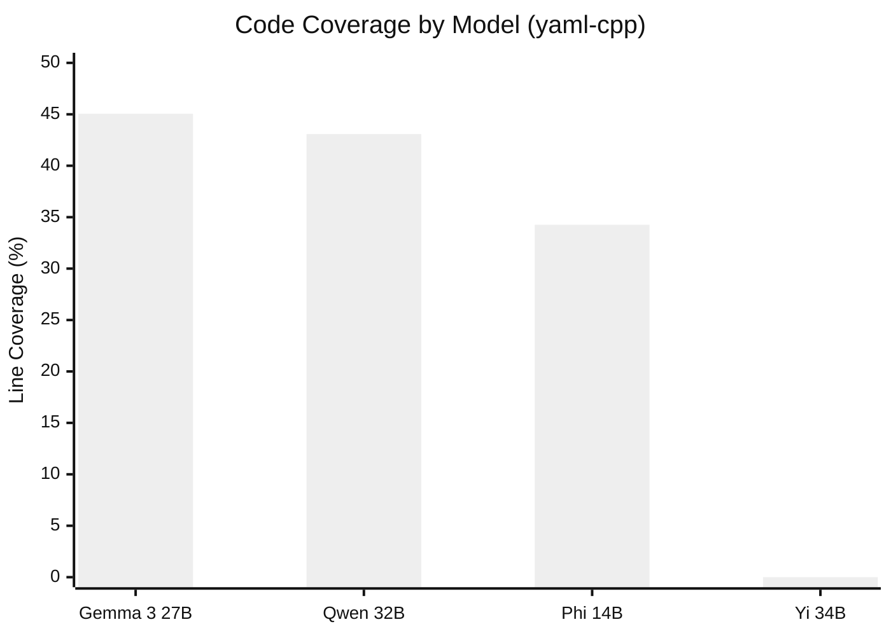
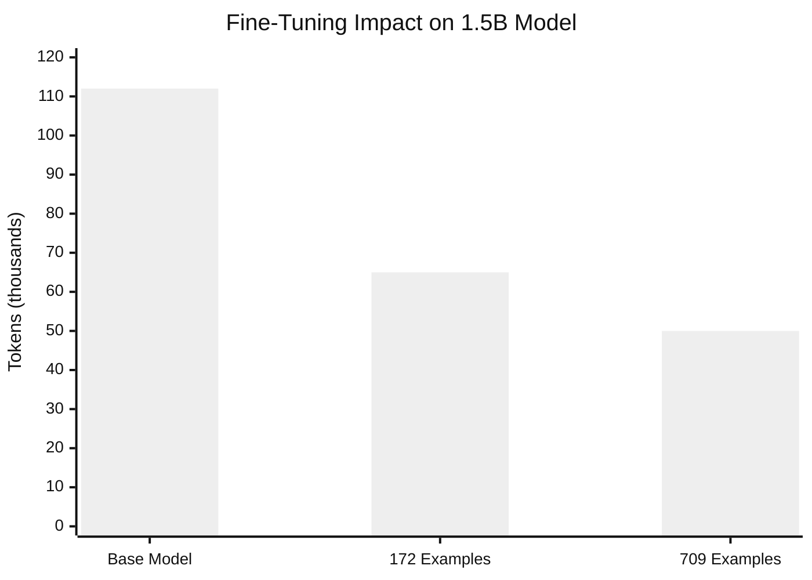
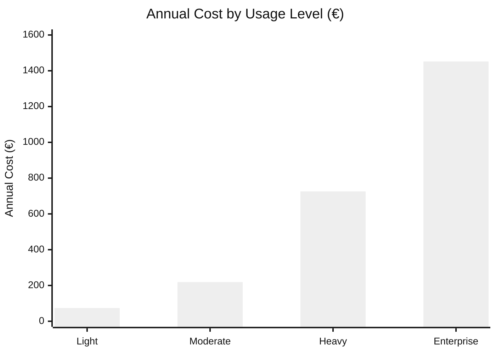
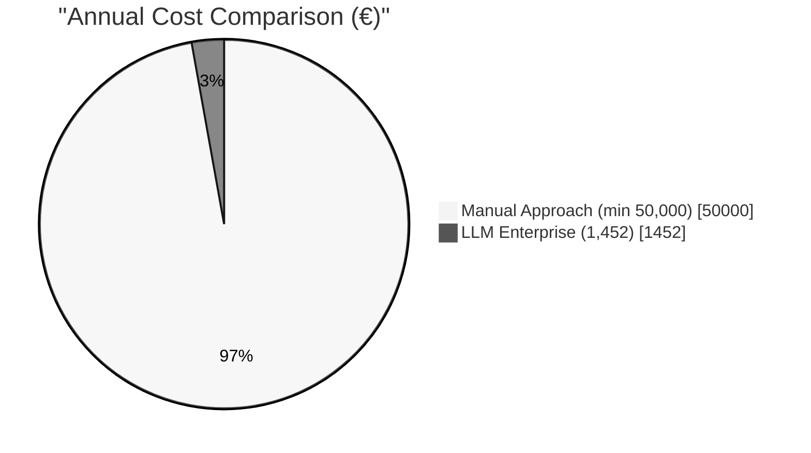

# 5 Experimental Results

In this chapter, I present the findings from our three-phase research. The experiments ran between May and September 2025. We tested multiple LLM models on yaml-cpp. We applied fine-tuning. We analyzed the economics. The results answer the research questions from Chapter 1.

## 5.1 Experimental Setup

### 5.1.1 Target Selection and Criteria

Choosing the right target was critical.

We needed C++ libraries. Safety-critical automotive systems run on AUTOSAR platforms. These are written in C or C++. Testing on Python would have been simpler. But less relevant to the actual problem.

We selected yaml-cpp as our primary target. This library parses YAML configuration files. A common task in automotive software. The library contains 35 source files with 1,061 potential fuzzing candidates. These were identified through cifuzz spark analysis. It is well-documented and actively maintained. OSS-Fuzz already covers it. That gave us a baseline for comparison.

Additional targets included pugixml, jsoncons, fmt, spdlog, and glm. These provided broader validation.

### 5.1.2 Hardware and Software Configuration

All local experiments ran on macOS. An Apple M1 Pro processor. The container runtime used Podman with 4 CPUs and 8 GB memory.

This choice was deliberate. Automotive teams do not have ML clusters. If our approach required expensive hardware, adoption would be limited.

The software stack: Podman for containers. CMake with Clang for building. libFuzzer via cifuzz for fuzzing. Ollama for local model inference. For enterprise testing, Azure OpenAI with GPT-4o via Azure Private Link.

## 5.2 LLM Fuzz Driver Generation Results

### 5.2.1 Successful Models: Performance Data

We evaluated models across different size categories. The target was yaml-cpp. The results surprised us.

| Model | Code Coverage | Time Taken | Tokens Used |
|-------|--------------|------------|-------------|
| Qwen 2.5-Coder 32B | 43.08% | 32m 57s | 45.1k |
| Gemma 3 27B | 45.06% | 33m 33s | 40.2k |
| Phi 14B | 34.26% | 36m 36s | 71.5k |

Gemma 3 27B achieved the highest coverage. 45.06%. The larger Qwen 2.5-Coder 32B reached only 43.08%. This was unexpected. The smaller model outperformed the larger one. It also used fewer tokens.

Phi 14B showed lower coverage at 34.26%. It required significantly more tokens. 71.5k. Not efficient for production.

### 5.2.2 Unsuccessful Models: Critical Findings

Several models failed completely. This was the biggest surprise of the research.

| Model | Failure Reason |
|-------|----------------|
| Yi 34B | Generation hallucinations, 0% coverage |
| DeepSeek R1 | Poor fuzzing context understanding |
| Mixtral 46.7B | Resource constraints due to size |

Yi 34B demonstrated a key limitation. General-purpose models struggle with specialized code tasks. Despite its size, it produced hallucinated outputs. Zero percent coverage. Nothing useful.

DeepSeek R1 was designed for reasoning. That did not translate to code generation. Mixtral's 46.7 billion parameters simply exceeded available hardware.

The pattern was clear. Code-specialized models outperformed larger general-purpose models. Size alone does not determine quality.

## 5.3 Model Optimization Results

### 5.3.1 LoRA Fine-Tuning Efficiency

Based on Phase 1, we selected the 1.5B model. We applied Low-Rank Adaptation fine-tuning. The training data came from Google's OSS-Fuzz project.

We curated two datasets. A small one with 172 examples. An extended one with 709 examples. Each example: a fuzz driver paired with its target API context. The examples focused on security vulnerability patterns, fuzzing techniques, and automotive-specific code.

The fine-tuning configuration:
- LoRA Rank: 16
- LoRA Alpha: 32
- Dropout: 0.1
- Target Modules: q_proj, v_proj, k_proj, o_proj
- Precision: float16

The results showed significant improvements:

| Model Version | Time Taken | Tokens Used | Improvement |
|--------------|------------|-------------|-------------|
| Base 1.5B | 15 min | 112k | Baseline |
| 172 examples | 12 min | 65k | 20% faster, 42% fewer tokens |
| 709 examples | 10 min | 50k | 33% faster, 55% fewer tokens |

The extended dataset achieved the best results. 33% faster generation. 55% fewer tokens. Domain-specific fine-tuning works.

### 5.3.2 Comparative Analysis

Training data quality and quantity both matter. The 709-example dataset outperformed the 172-example dataset. More diverse examples help the model generalize.

The key insight: a fine-tuned small model matches larger models. It uses far fewer resources. Enterprise deployment becomes practical.

## 5.4 Economic Analysis and Resource Metrics

We analyzed costs in detail. The question: is LLM-based fuzzing economically viable?

### 5.4.1 Azure OpenAI Cost Projections

Based on Azure OpenAI pricing:

| Usage Level | Daily Cost | Monthly Cost | Annual Cost |
|------------|------------|--------------|-------------|
| Light | €0.28 | €6.16 | €73.92 |
| Moderate | €0.83 | €18.26 | €219.12 |
| Heavy | €2.75 | €60.50 | €726.00 |
| Enterprise | €5.50 | €121.00 | €1,452.00 |

Even at enterprise level, annual costs stay under €1,500. Minimal compared to alternatives.

### 5.4.2 Comparison with Manual Testing

CARIAD internal estimates:
- Senior security engineer: €80-120 per hour
- Time to write a fuzz driver: 2-8 hours per target
- Annual cost for full-time equivalent: €50,000-€200,000

The AI-driven approach:
- Infrastructure: €219-€1,452 annually
- Time savings: estimated 90% reduction
- ROI: 2000-5000% cost reduction potential

The economic advantage is substantial. Even with human oversight.

## 5.5 Summary

The experiments produced clear findings.

First, specialization matters more than size. Gemma 3 27B outperformed Yi 34B. The code-specialized model beat the larger general-purpose model.

Second, fine-tuning enables efficient deployment. The fine-tuned 1.5B model achieved 33% faster generation. 55% fewer tokens. Comparable quality to larger models.

Third, the economics are favorable. Annual costs: €74 to €1,452. Manual approach: €50,000+. The difference is dramatic.

These findings address our research questions directly. LLMs can generate effective fuzz drivers with over 40% coverage (RQ1). Smaller specialized models match larger ones when fine-tuned (RQ2). Enterprise deployment is feasible at under €1,500 annually (RQ3).

---

## Mermaid Diagram Code for Chapter 5

### Figure 5.1: Model Performance Comparison (yaml-cpp)

### Figure 5.2: LoRA Fine-Tuning Efficiency

### Figure 5.3: Annual Cost Comparison

### Figure 5.4: Cost Comparison (Manual vs LLM)

**Note:** Render using Mermaid Live Editor (https://mermaid.live), VS Code with Mermaid extension, or `mmdc -i diagram.mmd -o diagram.pdf`. Export as PDF or PNG for LaTeX.
