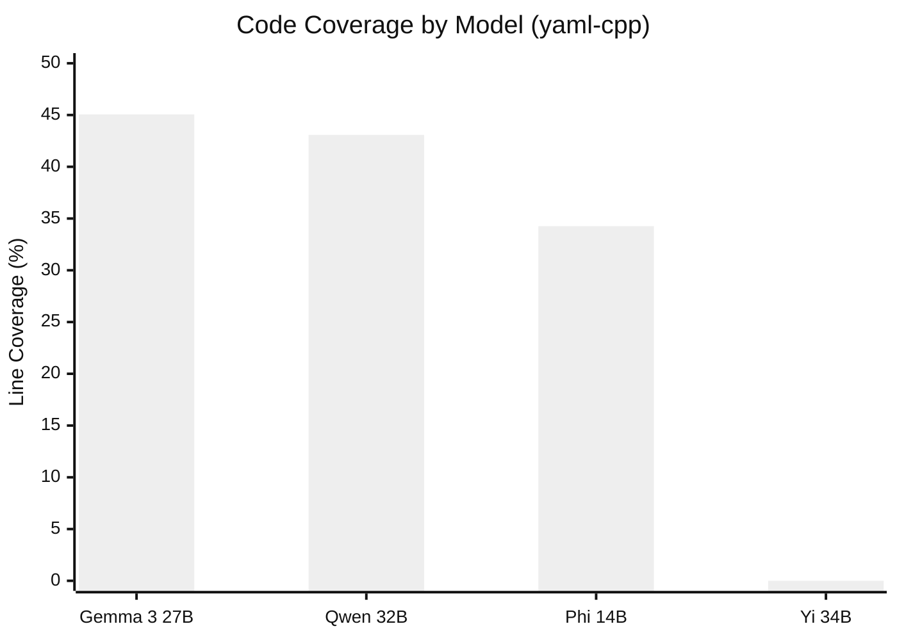
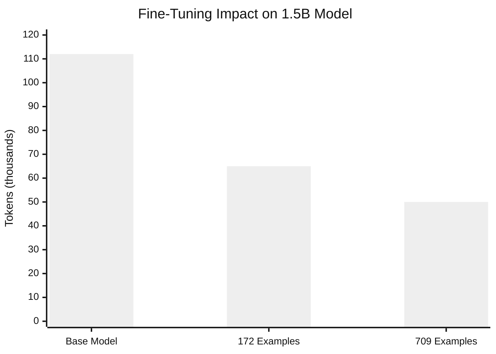
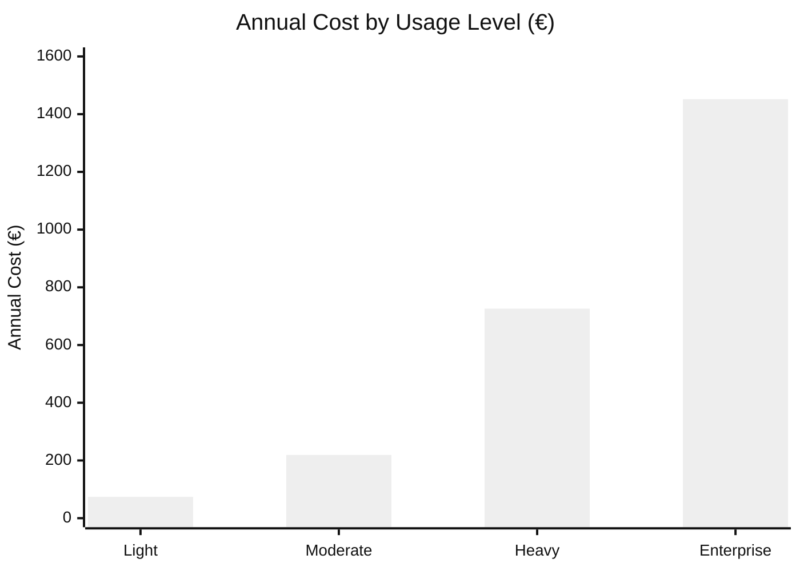
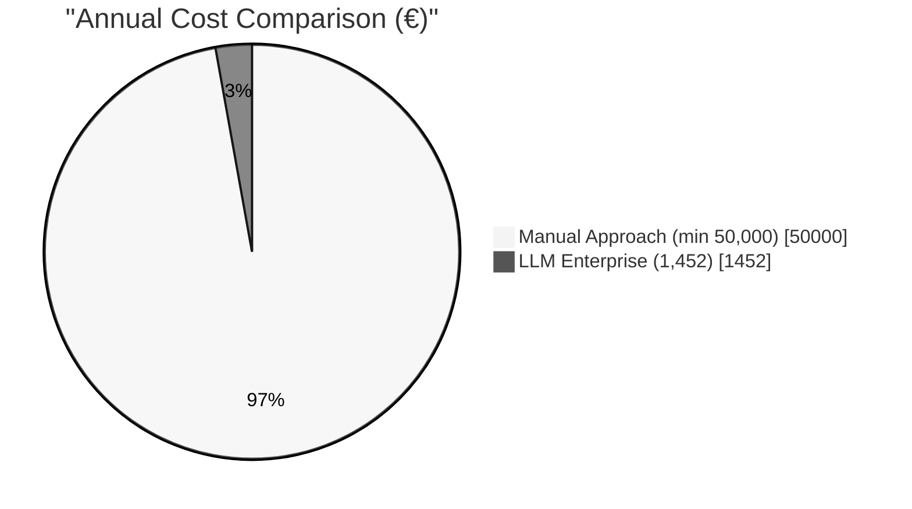

# 5 Experimental Results

In this chapter, I present the experimental findings from the three-phase research conducted between May and September 2025. We tested multiple LLM models on yaml-cpp as our primary target, applied fine-tuning to optimize a small model, and analyzed the economics of enterprise deployment. The results directly address the research questions defined in Chapter 1.

## 5.1 Experimental Setup

### 5.1.1 Target Selection and Criteria

Choosing the right target libraries was critical. We needed C++ libraries because safety-critical systems on AUTOSAR platforms are predominantly written in C or C++. Testing the approach on Python would have been simpler but less relevant to automotive applications.

We selected yaml-cpp as the primary evaluation target. This library parses YAML configuration files, a common task in automotive software. The library contains 35 source files with 1,061 potential fuzzing candidates identified through cifuzz spark analysis. It is well-documented, actively maintained, and has existing OSS-Fuzz coverage for baseline comparison.

Additional target repositories included pugixml (XML processing), jsoncons (JSON processing), fmt (formatting), spdlog (logging), and glm (mathematics for graphics). These were used for broader validation of the approach.

### 5.1.2 Hardware and Software Configuration

All local experiments ran on macOS with an Apple M1 Pro processor. The container runtime used Podman with 4 CPUs and 8 GB memory allocated. This choice was deliberate. Automotive development teams typically lack access to dedicated ML clusters. If our approach required expensive hardware, adoption would be limited.

The software stack consisted of Podman (chosen over Docker for enterprise compatibility), CMake with Clang for building, libFuzzer via cifuzz for fuzzing, and Ollama for local model inference. For enterprise deployment testing, we used Azure OpenAI with GPT-4o connected via Azure Private Link.

## 5.2 LLM Fuzz Driver Generation Results

### 5.2.1 Successful Models: Performance Data

We evaluated models across different size categories on the yaml-cpp repository. The results are shown below.

| Model | Code Coverage | Time Taken | Tokens Used |
|-------|--------------|------------|-------------|
| Qwen 2.5-Coder 32B | 43.08% | 32m 57s | 45.1k |
| Gemma 3 27B | 45.06% | 33m 33s | 40.2k |
| Phi 14B | 34.26% | 36m 36s | 71.5k |

Gemma 3 27B achieved the highest code coverage at 45.06%, slightly outperforming the larger Qwen 2.5-Coder 32B which reached 43.08%. This was surprising. The smaller Gemma model outperformed the larger Qwen model on coverage while using fewer tokens.

Phi 14B showed lower coverage at 34.26% but required significantly more tokens (71.5k), making it less efficient for production use.

### 5.2.2 Unsuccessful Models: Critical Findings

Several models failed to produce usable fuzz drivers. This was our biggest surprise.

| Model | Failure Reason |
|-------|----------------|
| Yi 34B | Generation hallucinations, 0% coverage |
| DeepSeek R1 | Poor fuzzing context understanding |
| Mixtral 46.7B | Resource constraints due to large parameter count |

Yi 34B demonstrated the limitations of general-purpose models for specialized code tasks. Despite its size, it produced hallucinated outputs achieving 0% coverage. DeepSeek R1, designed for reasoning tasks, did not translate well to code generation. Mixtral's 46.7 billion parameters exceeded available hardware resources.

The pattern was clear. Code-specialized models like Qwen Coder outperformed larger general-purpose models. Model size alone does not determine quality for specialized tasks like fuzz driver generation.

## 5.3 Model Optimization Results

### 5.3.1 LoRA Fine-Tuning Efficiency

Based on Phase 1 results, we selected the 1.5B model and applied Low-Rank Adaptation (LoRA) fine-tuning using high-quality fuzz drivers from Google's OSS-Fuzz project.

We curated two training datasets: a small dataset with 172 examples and an extended dataset with 709 examples. Each example consisted of a fuzz driver paired with its target API context, focused on security vulnerability patterns, fuzzing techniques, and automotive-specific code patterns. The fine-tuning configuration used:
- LoRA Rank: 16
- LoRA Alpha: 32
- Dropout: 0.1
- Target Modules: q_proj, v_proj, k_proj, o_proj
- Precision: float16

The results showed significant efficiency improvements:

| Model Version | Time Taken | Tokens Used | Improvement |
|--------------|------------|-------------|-------------|
| Base 1.5B | 15 min | 112k | Baseline |
| 172 examples | 12 min | 65k | 20% faster, 42% fewer tokens |
| 709 examples | 10 min | 50k | 33% faster, 55% fewer tokens |

The extended dataset (709 examples) achieved the best results: 33% faster generation and 55% fewer tokens compared to the base model. This demonstrates that domain-specific fine-tuning significantly improves efficiency without requiring larger models.

### 5.3.2 Comparative Analysis

The fine-tuning results show that training data quality and quantity both contribute to improvements. The 709-example dataset provided better results than the 172-example dataset, suggesting that more diverse training examples help the model generalize better.

Key insight: A fine-tuned small model can achieve comparable results to larger models while using significantly fewer computational resources. This makes enterprise deployment more practical.

## 5.4 Economic Analysis and Resource Metrics

We conducted detailed cost analysis to determine whether LLM-based fuzzing is economically viable for enterprise deployment.

### 5.4.1 Azure OpenAI Cost Projections

Based on Azure OpenAI pricing, we calculated annual costs for different usage levels:

| Usage Level | Daily Cost | Monthly Cost | Annual Cost |
|------------|------------|--------------|-------------|
| Light | €0.28 | €6.16 | €73.92 |
| Moderate | €0.83 | €18.26 | €219.12 |
| Heavy | €2.75 | €60.50 | €726.00 |
| Enterprise | €5.50 | €121.00 | €1,452.00 |

Even at the enterprise level with complete automation, annual costs remain under €1,500. This is minimal compared to alternative approaches.

### 5.4.2 Comparison with Manual Testing

Based on CARIAD internal estimates:
- Senior security engineer hourly rate: €80-120
- Time to write effective fuzz driver: 2-8 hours per target
- Annual cost for full-time equivalent: €50,000-€200,000

The AI-driven approach offers:
- Infrastructure cost: €219-€1,452 annually
- Developer time savings: estimated 90% reduction
- ROI: 2000-5000% cost reduction potential

Even accounting for human oversight and quality verification, the economic advantage is substantial.

## 5.5 Summary

The experiments produced several key findings.

First, model specialization matters more than size. Code-specialized models achieved better results than larger general-purpose models. Gemma 3 27B outperformed Yi 34B despite having fewer parameters.

Second, fine-tuning enables efficient deployment. The fine-tuned 1.5B model achieved 33% faster generation and 55% fewer tokens compared to the base model.

Third, the economics are favorable. Annual costs range from €74 for light usage to €1,452 for full enterprise deployment, compared to €50,000+ for manual approaches.

These findings directly address our research questions. LLMs can generate effective fuzz drivers with over 40% code coverage (RQ1). Smaller specialized models match or exceed larger general-purpose models when fine-tuned (RQ2). Enterprise deployment is feasible with appropriate infrastructure investment at costs under €1,500 annually (RQ3).

---

## Mermaid Diagram Code for Chapter 5

### Figure 5.1: Model Performance Comparison (yaml-cpp)

### Figure 5.2: LoRA Fine-Tuning Efficiency

### Figure 5.3: Annual Cost Comparison

### Figure 5.4: Cost Comparison (Manual vs LLM)

**Note:** These diagrams can be rendered using the Mermaid Live Editor (https://mermaid.live), VS Code with Mermaid extension, or command-line tool `mmdc -i diagram.mmd -o diagram.pdf`. Export as PDF or high-resolution PNG for LaTeX compilation.
