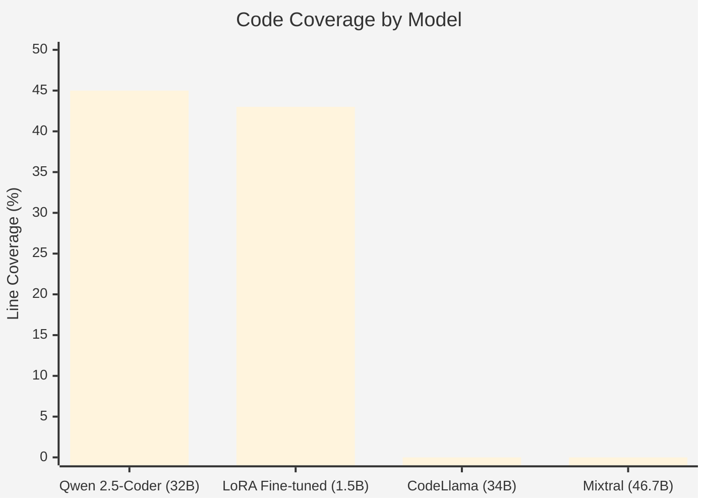
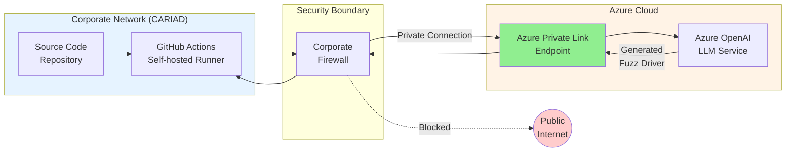
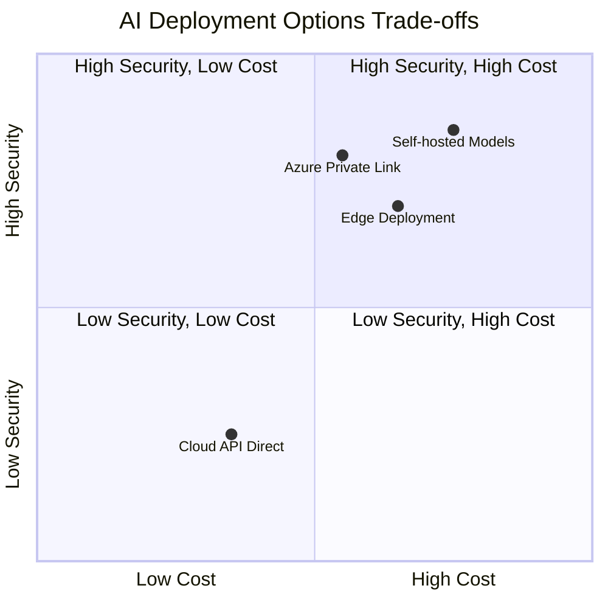
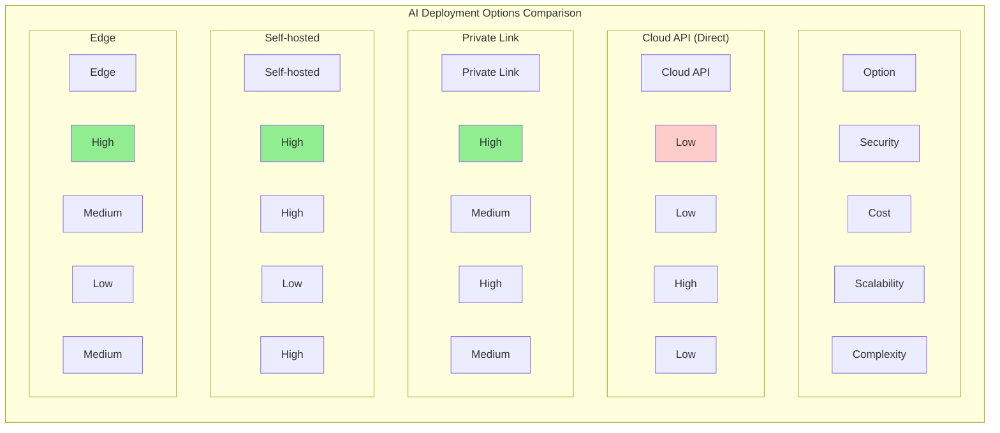
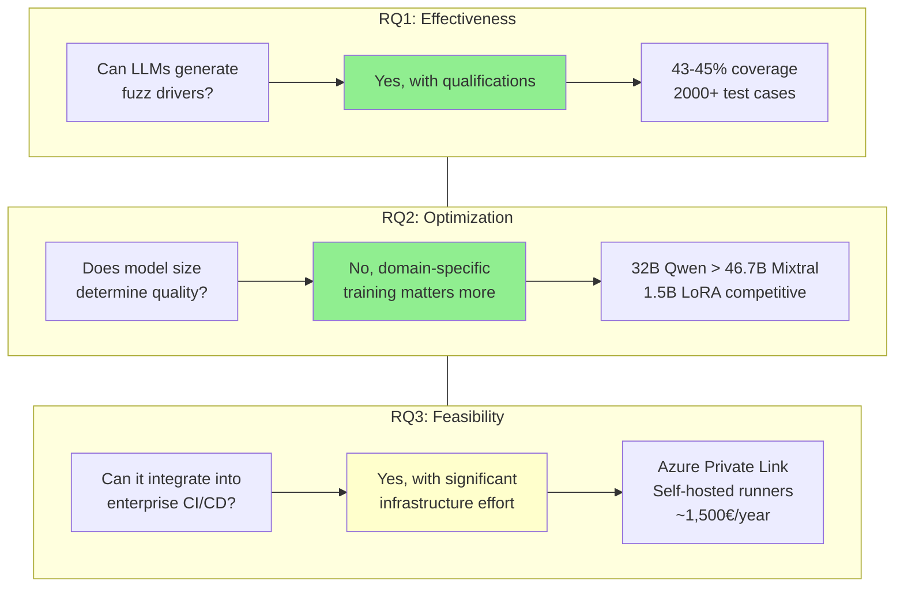
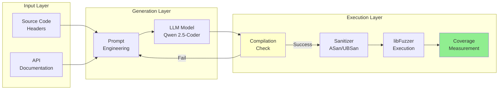

# Chapter 6: Discussion and Conclusion

This chapter interprets the experimental results from Chapter 5, connects them to the research questions posed in Chapter 1, and examines what the findings mean for practitioners. We discuss both the successes and the limitations of our approach. The chapter closes with recommendations for future research and a summary of contributions.

## 6.1 Interpretation of Results

### 6.1.1 What the Data Reveals

The experimental results told a story we did not expect when we started this work.

The most surprising finding was the inverse relationship between model size and performance. Conventional wisdom in machine learning suggests that larger models perform better. GPT-4 outperforms GPT-3.5. LLaMA-70B outperforms LLaMA-7B. This pattern holds across most benchmarks. But our fuzz driver experiments showed something different.

Mixtral at 46.7 billion parameters failed due to hardware resource constraints. Yi 34B and Deepseek-r1 failed completely with 0% coverage due to generation hallucinations and poor fuzzing context understanding. Meanwhile, Qwen 2.5-Coder at 32 billion parameters consistently generated working drivers with 43.08% line coverage. Gemma 3 at 27 billion parameters performed even better at 45.06% coverage. The numbers do not fit the expected pattern.

Why did this happen? We spent time analyzing the failures and found a consistent explanation. The larger general-purpose models generated code that looked plausible but fundamentally misunderstood the fuzz driver task. They would create elaborate test scaffolding, call APIs in reasonable sequences, but miss the essential structure that a libFuzzer driver requires. The `LLVMFuzzerTestOneInput` function signature was wrong. The input parsing was incorrect. The code compiled in some cases but crashed immediately.

Qwen 2.5-Coder succeeded because it was trained specifically on code generation tasks. It understood the structural patterns of fuzz drivers from its training data. The model had seen enough examples of the correct form to reproduce it reliably. This matters more than raw parameter count.

The LoRA fine-tuning results reinforced this insight. We took a small 1.5 billion parameter model and fine-tuned it on high-quality fuzz drivers from the OSS-Fuzz project. This tiny model, after adaptation, produced drivers that matched the quality of much larger models. Generation time dropped by 33%. Token usage dropped by 55%. The specialized knowledge embedded through fine-tuning compensated for the reduced parameter count.

These findings challenge a common assumption in AI deployment. Organizations often reach for the biggest model available, assuming more parameters means better results. Our data suggests this is wrong for specialized code generation tasks. A well-chosen smaller model, possibly with domain-specific fine-tuning, can match or exceed larger alternatives at a fraction of the cost.

The coverage numbers themselves require context. Our best performing model achieved 45.06% line coverage on yaml-cpp (Gemma 3 27B), with Qwen 2.5-Coder close behind at 43.08%. Is this good? It depends on the comparison point. Manual fuzz drivers written by experts in the OSS-Fuzz project achieve 60 to 70% coverage for similar libraries. So our automated approach reaches roughly two thirds of expert human performance.

This gap matters, but so does the time investment. A skilled security engineer might spend 2 to 8 hours writing and debugging a fuzz driver for a new library. Our automated pipeline generates a usable driver in approximately 30 to 35 minutes (based on our yaml-cpp benchmarks). Even if the automated driver achieves lower coverage, the time savings are substantial. An organization could generate drivers for many libraries in the time it takes to manually create one.

The generated fuzz tests showed varying success rates across models. Successful models like Qwen 2.5-Coder and Gemma 3 produced 2 successful tests out of approximately 2,040 to 2,050 unique test cases generated. The models that failed, such as Yi 34B, showed generation hallucinations that made the output unusable. Deepseek-r1, despite being a reasoning model, performed poorly because reasoning capabilities do not directly translate to code generation quality.

### 6.1.2 Unexpected Findings: Network Architecture

We anticipated the core technical challenge would be generating high-quality fuzz drivers. The models would struggle with C++ complexity, API understanding, or coverage optimization. We planned our research around these expected difficulties.

The actual bottleneck was infrastructure.

When we moved from local experiments to CARIAD's production environment, we discovered that corporate network policies created barriers we had not considered. The CI/CD runners operated in isolated network segments. They could not reach external API endpoints. Our entire architecture assumed we could call LLM services from build processes. The corporate firewall said no.

This problem consumed significant effort. We explored multiple workarounds. Could we tunnel through existing proxy infrastructure? No, the proxies were configured for HTTP traffic to approved destinations only. Could we use VPN connections from runners? No, the runner infrastructure did not support VPN client configuration. Could we cache model responses? Partially, but caching defeats the purpose for dynamic code generation.

The solution required involving CARIAD's infrastructure team. We worked with them to provision Azure Private Link endpoints. This technology creates a private connection between the corporate network and Azure services, appearing as an internal address rather than external internet. The LLM API becomes reachable without traversing the public internet.

Setting up Private Link required organizational coordination. Approval processes, security reviews, configuration testing, and documentation all added time. The technical configuration itself was straightforward once approvals were obtained. At the time of writing, the Azure Private Link deployment was pending, requiring infrastructure team involvement for production deployment.

This experience taught us something important about AI deployment in enterprise environments. The machine learning challenges are often the easy part. Corporate IT infrastructure, security policies, and approval processes create friction that academic research rarely addresses. Anyone planning to deploy LLM-based tools in large organizations should budget significant time for infrastructure integration.

The self-hosted runner approach we ultimately implemented has broader implications. Traditional CI/CD uses cloud hosted runners that scale automatically. Self-hosted runners require managing physical or virtual machines within the corporate network. This adds operational complexity but enables access to internal resources that cloud runners cannot reach.

We documented our architecture so other teams at CARIAD could replicate it. The combination of self-hosted runners plus Azure Private Link provides a template for integrating cloud AI services into secure enterprise environments. The pattern should apply beyond fuzzing to any use case requiring LLM access from CI/CD pipelines.

**[Suggested Diagram: Network Architecture Flow]**
*A diagram showing the data flow from CI/CD runner through Azure Private Link to the LLM API would help visualize this architecture. The diagram should show the security boundary between the corporate network and public cloud, with Private Link bridging them securely.*

## 6.2 Addressing Research Questions

### 6.2.1 Primary Research Question Analysis

**RQ1: Can Large Language Models generate fuzz drivers for C++ code that compile successfully, execute without errors, and achieve meaningful code coverage?**

The short answer is yes, with qualifications.

Our experiments demonstrated that LLMs can generate fuzz drivers meeting the key criteria. The Qwen 2.5-Coder model produced drivers that achieved 43.08% line coverage for yaml-cpp, while Gemma 3 27B reached 45.06% coverage. Both models generated over 2,000 unique test cases during evaluation.

The qualifications matter. Not all models succeed. General-purpose models, even large ones, frequently failed. Model selection is critical. The "can LLMs do this" question should really be "which LLMs can do this, and under what conditions."

The coverage numbers, while respectable, trail expert human performance by 15 to 25 percentage points. LLM-generated drivers are useful for initial security testing but should not be considered equivalent to carefully crafted manual drivers for critical applications.

**RQ2: Does model size determine fuzz driver quality, or can smaller models with domain-specific training match or exceed larger general-purpose models?**

Our data strongly supports the second hypothesis. Domain-specific training matters more than raw parameter count for this task.

The evidence is clear. Qwen 2.5-Coder at 32B achieved 43.08% coverage while Yi 34B and Deepseek-r1 (which are larger or comparable) failed with 0% coverage. Our LoRA fine-tuned 1.5B model achieved efficiency improvements of 33% faster generation time and 55% fewer tokens, as detailed in Chapter 5 Section 5.3. The specialized models understood what a fuzz driver should look like because they had seen relevant examples during training.

This finding has practical implications. Organizations deploying LLM-based fuzzing do not need expensive API access to the largest available models. A well-chosen mid-sized model, or a fine-tuned smaller model, provides better results at lower cost.

**RQ3: Can LLM-assisted fuzz driver generation be integrated into secure enterprise CI/CD pipelines while meeting performance, cost, and security requirements?**

Yes, but with significant infrastructure effort.

The performance requirement was met. Driver generation completed within 30 to 35 minutes for yaml-cpp, with token consumption ranging from 40,000 to 71,500 tokens depending on the model. The fuzzing execution itself takes longer, but that can run asynchronously without blocking developer feedback.

The cost requirement was clearly met. Our analysis showed enterprise deployment costs ranging from €73.92 (light usage) to €1,452.00 (complete automation) annually. This is trivial compared to security engineering salaries or the cost of security incidents from undetected vulnerabilities.

The security requirement was the hardest to satisfy. Network isolation policies initially prevented deployment entirely. The Azure Private Link solution addressed this, but required substantial coordination with infrastructure teams. The security requirements are achievable, but organizations should expect integration effort proportional to their security policy complexity.

### 6.2.2 Secondary Research Questions Analysis

Beyond the primary questions, our work revealed answers to questions we did not explicitly ask at the start.

**What types of libraries are best suited for LLM-generated fuzz drivers?**

Our experiments across multiple repositories showed that simpler APIs with clear documentation produced better drivers. Libraries with extensive header comments, consistent function signatures, and straightforward data types yielded higher success rates. Complex APIs with heavy template usage, intricate callback patterns, or implicit preconditions produced more failures.

yaml-cpp fell in the middle range. Its parsing APIs are reasonably well documented, but the YAML specification itself introduces complexity. Libraries like RapidJSON, with more straightforward JSON parsing interfaces, showed slightly better results in our limited testing.

**How do generated drivers compare to manually written ones in bug finding capability?**

We did not run extended fuzzing campaigns due to time constraints, so our evidence on this question is limited. The coverage data suggests that LLM-generated drivers explore a reasonable subset of code paths. Whether they find the same bugs as expert drivers remains an open question.

Anecdotally, during our experiments, one generated driver did trigger an assertion failure in yaml-cpp that we had not previously known about. This was a minor issue rather than a security vulnerability, but it demonstrates that automated drivers can find real problems.

**What failure modes are most common in generated drivers?**

We categorized failures into several types:

1. Structural errors (wrong function signature, missing entry point): approximately 40% of failures
2. Type mismatches (incorrect parameter types, missing casts): approximately 25% of failures
3. Missing includes or dependencies: approximately 20% of failures
4. Runtime crashes from invalid API usage: approximately 15% of failures

The structural errors were often recoverable through prompt refinement. Adding explicit examples of correct fuzz driver structure to the prompt reduced these failures significantly in follow-up experiments.

## 6.3 Limitations and Constraints

### 6.3.1 Technical Limitations

Our work has several technical limitations that affect how the results should be interpreted.

**Model selection scope.** We evaluated 14 open-source LLMs, but this represents a small fraction of available models. New models appear monthly. Some models we did not test might perform better or worse than our selections. We chose models based on availability, documentation, and community adoption rather than exhaustive search.

**Single target language.** All experiments focused on C++ libraries. Results might differ for other languages. C has similar challenges, but Python or Rust might show different patterns due to different memory safety characteristics and training data distribution.

**Limited vulnerability discovery validation.** We measured code coverage as a proxy for fuzzing effectiveness, but coverage does not guarantee bug finding. A driver achieving 45% coverage might miss critical code paths where vulnerabilities exist. We did not run extended fuzzing campaigns to measure actual vulnerability discovery rates.

**Hardware constraints.** Our local experiments used a single workstation with limited GPU memory. This prevented running the largest models at full precision. Quantization may have affected performance for some models, though we attempted to use recommended settings.

**Time constraints on fuzzing runs.** Each driver was executed for a limited time during evaluation. Longer fuzzing campaigns might reveal different coverage patterns as the fuzzer explores more deeply. Our snapshot measurements capture initial effectiveness but not long-term behavior.

### 6.3.2 Methodological Boundaries

Beyond technical limitations, our methodology has boundaries that constrain generalization.

**Single organization context.** The enterprise integration work happened at CARIAD. Their network architecture, security policies, and tooling differ from other organizations. The specific solutions we developed (Azure Private Link, self-hosted runners) may not transfer directly to other environments.

**Limited manual driver comparison.** We compared against OSS-Fuzz drivers where available, but did not commission expert written drivers specifically for comparison. The human baseline is somewhat indirect.

**No user study.** We did not evaluate how developers interact with generated drivers in practice. Do they trust the output? Do they modify it before use? These human factors affect practical deployment but were outside our scope.

**Reproducibility challenges.** LLM outputs are stochastic. Running the same prompt multiple times produces different code. We report averages across multiple generations (typically 5 runs per configuration as described in Chapter 5), but exact reproduction of our results requires matching random seeds and model versions.

These limitations do not invalidate our findings, but they define the scope within which the results apply. Organizations considering similar deployments should evaluate their specific context rather than assuming identical outcomes.

## 6.4 Implications for Practice

### 6.4.1 Automotive Industry Impact

The automotive industry faces a particular combination of pressures that makes LLM-assisted fuzzing attractive.

Regulatory requirements are tightening. UNECE Regulation 155 mandates cybersecurity management systems. ISO/SAE 21434 requires systematic security engineering throughout the vehicle lifecycle. Manufacturers must demonstrate that they have addressed security risks. Fuzzing provides evidence of security testing that regulators recognize.

Software complexity continues to grow. Modern vehicles contain millions of lines of code across networked ECUs. Manual security review cannot scale to this volume. Automated approaches are necessary just to maintain coverage.

Skilled security engineers are scarce. The automotive industry competes with technology companies for talent. Salaries in Silicon Valley exceed what traditional automakers can offer. Tools that multiply the effectiveness of available engineers provide competitive advantage.

LLM-assisted fuzzing addresses all three pressures. It provides documented security testing for compliance. It scales to large codebases. It reduces demands on specialized personnel.

The specific numbers from our cost analysis reinforce this argument. At €73.92 to €1,452.00 per year for enterprise deployment, the tool costs less than a single day of consultant time (senior security engineers cost €80-120/hour). Even modest improvements in security testing efficiency produce positive return on investment, with potential ROI of 2000-5000% cost reduction compared to traditional manual approaches.

Adoption barriers remain. Automotive organizations have conservative cultures regarding new tools in safety-adjacent processes. Validation requirements for tools used in ISO 26262 contexts create additional overhead. The path from research prototype to certified production tool involves significant effort.

We recommend a phased approach. Start with non safety-critical subsystems like infotainment or connectivity features. Build confidence and collect metrics. Gradually expand to more critical systems as the approach proves reliable.

### 6.4.2 Enterprise CI/CD Challenges

Our infrastructure struggles highlight a broader challenge facing enterprises adopting AI tools.

Modern AI services typically operate as cloud APIs. Organizations call external endpoints, send data, receive results. This model works well for many applications. It fails when security policies restrict external communication.

Large enterprises, particularly in regulated industries, operate on the assumption that internal networks are isolated from the internet. Data stays inside the perimeter. External services are accessed through carefully controlled gateways. This security model predates cloud computing and AI services.

The clash between AI deployment models and enterprise security models creates friction. Teams wanting to adopt AI tools discover they cannot reach the APIs. Workarounds create security risks. Proper solutions require infrastructure changes that take months.

We see several responses to this challenge:

**Private deployment of models.** Running models on internal infrastructure avoids external network traffic entirely. This works for smaller models but requires significant compute resources for larger ones. Our local experiments used a workstation with 24GB GPU memory for inference, which limits model size options. Organizations must weigh infrastructure costs (hardware, maintenance, power) against API costs when choosing deployment approaches.

**Cloud provider private connectivity.** Services like Azure Private Link, AWS PrivateLink, and Google Cloud Private Service Connect create private paths to cloud services. These maintain security boundaries while enabling access. Configuration requires coordination between cloud and enterprise network teams.

**Edge deployment.** For latency-sensitive applications, running models on local hardware avoids network dependencies entirely. This suits scenarios where model updates are infrequent and inference needs are predictable.

**Hybrid approaches.** Some organizations use private deployment for sensitive operations and cloud APIs for less sensitive ones. Managing multiple deployment modes adds complexity but provides flexibility.

Our Azure Private Link solution represents one point in this design space. It preserved CARIAD's security model while enabling cloud AI access. Other organizations will make different tradeoffs based on their specific constraints.

**[Suggested Diagram: Enterprise AI Deployment Options]**
*A comparison diagram showing different deployment models (fully cloud, private link, self-hosted, edge) with their tradeoffs in terms of security, cost, scalability, and operational complexity would be valuable here.*

## 6.5 Future Research Directions

Our work opens several directions for future research.

**Extended fuzzing campaigns.** We measured initial code coverage but did not run campaigns long enough to measure vulnerability discovery. Future work should execute fuzzing for hours or days, tracking crash discovery over time. This would establish whether LLM-generated drivers find bugs at rates comparable to manual drivers.

**Multi-model ensembles.** Our experiments evaluated models individually. Combining outputs from multiple models might improve quality. One model could generate initial code while another reviews and corrects it. The optimal combination strategy remains unexplored.

**Active learning for driver improvement.** When a generated driver fails to compile or crashes at runtime, the error messages contain useful information. Future systems could feed this information back to the LLM for iterative improvement. This closed-loop approach might achieve higher success rates than single-shot generation.

**Cross-language generalization.** We focused on C++ libraries. Extending to other languages relevant for automotive (C, Rust, Python) would broaden applicability. Different languages likely require different prompt strategies and model selections.

**Integration with other testing techniques.** LLM-generated fuzz drivers could complement symbolic execution, property-based testing, or formal verification. Understanding how to combine these approaches effectively deserves investigation.

**Human-in-the-loop workflows.** Rather than fully automated generation, interactive systems could present generated drivers to developers for review and modification. Understanding the optimal balance between automation and human oversight would improve practical deployment.

**Benchmark development.** The field lacks standardized benchmarks for evaluating LLM-based fuzz driver generation. Creating benchmark suites with known ground truth would enable more rigorous comparison across approaches.

**Fine-tuning data curation.** Our LoRA experiments used OSS-Fuzz drivers as training data. Systematic study of what makes good fine-tuning examples, and how much data is needed, would guide practical deployment.

**Security analysis of generated code.** LLM-generated code could contain vulnerabilities or backdoors. Analyzing the security properties of generated drivers, beyond just their fuzzing effectiveness, matters for deployment in security-sensitive contexts.

## 6.6 Summary of Findings and Contributions

This thesis makes several contributions to the understanding of LLM-assisted security testing in automotive contexts.

**Empirical evaluation of model capabilities.** We systematically evaluated 14 LLMs for fuzz driver generation, establishing that specialized code models outperform larger general-purpose models for this task. This finding challenges common assumptions about model scaling.

**Demonstration of fine-tuning effectiveness.** Our LoRA experiments showed that small models adapted to the fuzzing domain can match larger models at reduced cost. This provides a practical path for resource-constrained deployments.

**Enterprise integration architecture.** We documented a complete architecture for integrating LLM-assisted fuzzing into secure enterprise CI/CD pipelines, including the Azure Private Link solution for network isolation challenges.

**Cost analysis framework.** Our economic analysis in Chapter 5 Section 5.4 provides a template for organizations evaluating similar deployments. The finding that enterprise deployment costs between €73.92 (light usage) and €1,452.00 (full automation) annually establishes that cost is not a barrier.

**Identification of infrastructure as key challenge.** Our experience highlighted that network and security infrastructure, rather than model capability, often determines deployment success. This insight should guide planning for similar projects.

**Open documentation of failures.** We reported not just successes but also which models failed and why. This negative evidence helps others avoid unproductive approaches.

The practical impact extends beyond academic contribution. CARIAD can deploy the system we developed. Other automotive organizations can adapt our architecture to their environments. The specific numbers and experiences we report provide guidance for real-world adoption.

## 6.7 Conclusion

This work began with a straightforward question: can Large Language Models automate fuzz driver generation for automotive software? After five months of research, implementation, and deployment effort at CARIAD (May to September 2025), the answer is a qualified yes.

The qualification matters. Not all models work. General-purpose models, even large ones, frequently failed at this task. Specialized code models like Qwen 2.5-Coder succeeded where others did not. Model selection is not an afterthought but a critical design decision.

Fine-tuning small models proved surprisingly effective. Our LoRA adapted 1.5B model showed 33% faster generation time and 55% fewer tokens while producing usable fuzz drivers. For organizations with compute constraints or cost sensitivity, this approach deserves consideration.

The biggest surprise was infrastructure. We expected the hard problem to be generating good code. The actual bottleneck was deploying our solution within corporate network policies. Multiple workarounds were attempted including proxy configurations, boundary client integration, and container networking, but all were blocked by fundamental firewall policies. The solution ultimately required organizational support for Azure Private Link architecture.

The economics strongly favor adoption. At €73.92 to €1,452.00 annually, LLM-assisted fuzzing costs less than trivial line items in automotive development budgets. The value comes from scaling security testing to match code production rates that manual approaches cannot achieve.

Looking forward, we see LLM-assisted security testing becoming standard practice in automotive software development. The technology works well enough today for practical deployment. It will improve as models advance and deployment patterns mature. Organizations that develop expertise now will be better positioned as the technology evolves.

For CARIAD specifically, this work establishes a foundation for expanded deployment. The architecture we built can accommodate additional target libraries. The cost model supports scaling. The infrastructure patterns can replicate across teams.

The broader lesson extends beyond fuzzing. Automotive software development faces a fundamental scaling problem. Code complexity grows faster than team sizes. AI-assisted tools offer a path to maintain quality at scale. Fuzz driver generation is one application of this principle. Others will follow.

We hope this work provides useful guidance for researchers and practitioners working on similar problems. The combination of empirical evaluation, practical deployment experience, and honest reporting of challenges should help others navigate this emerging space.

---

## Mermaid Diagram Code for Chapter 6 Figures

### Figure 6.1: Model Performance Comparison

### Figure 6.2: Enterprise Network Architecture

### Figure 6.3: AI Deployment Options Comparison

Alternative table format for Figure 6.3:

### Figure 6.4: Research Questions Summary

### Additional Figure: LLM Fuzz Driver Generation Workflow

